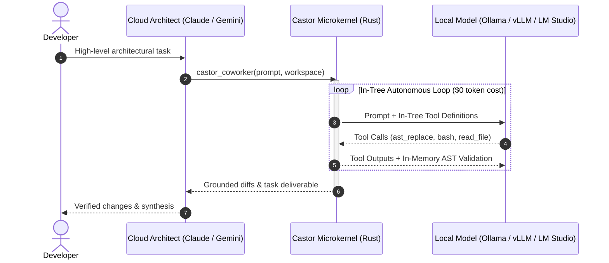
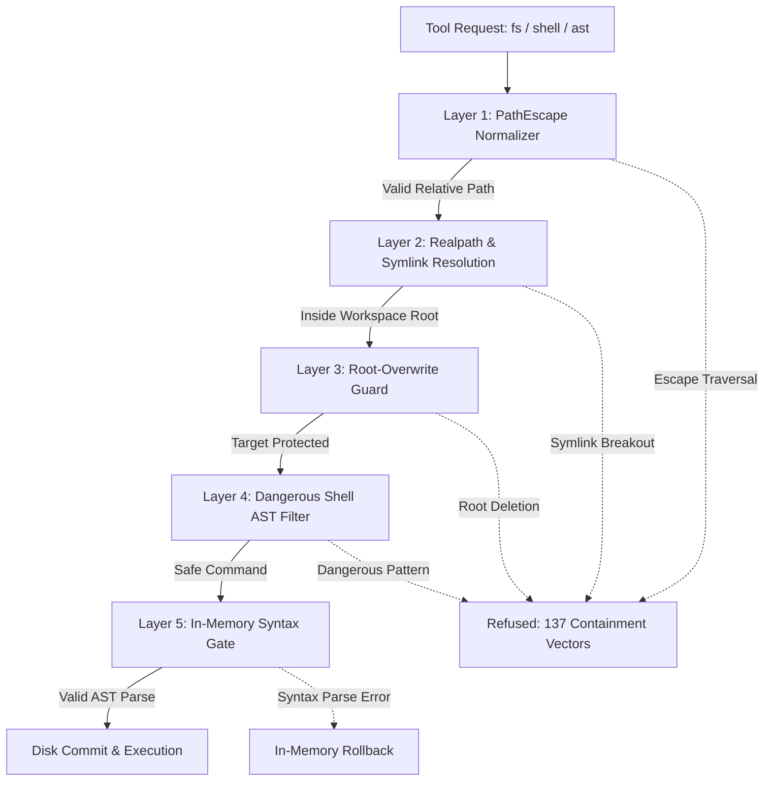

# Castor

> Pair cloud orchestrators (Claude, Gemini, Antigravity) with local execution models (Ollama, vLLM, LM Studio) via MCP — offloading AST surgery, file operations, and test loops at **$0 token cost**.

[](#testing--verification)
[](https://www.npmjs.com/package/mcp-castor)
[](https://www.rust-lang.org/)
[](LICENSE)
[](#testing--verification)

---

## Quickstart

### 1. Install & Register (1 Command)

Register Castor automatically with all detected MCP clients (Claude Code, Claude Desktop, Antigravity IDE):

```bash
# Run directly via npx
npx -y mcp-castor install --client all

# Or install globally
npm install -g mcp-castor
castor install --client all
```

Or configure manually in your MCP client configuration (`claude_desktop_config.json` or `mcp_config.json`):

```json
{
  "mcpServers": {
    "castor": {
      "command": "npx",
      "args": ["-y", "mcp-castor", "mcp"]
    }
  }
}
```

### 2. Connect Your Local Model

Castor connects to any OpenAI-compatible local endpoint. By default, it looks for `http://127.0.0.1:18020/v1`:

```bash
# Ollama (port 11434)
export CASTOR_BASE_URL="http://127.0.0.1:11434/v1"
export CASTOR_MODEL="qwen2.5-coder:32b"

# LM Studio (port 1234)
export CASTOR_BASE_URL="http://127.0.0.1:1234/v1"
export CASTOR_MODEL="qwen3.8-27b"

# vLLM (default port 18020)
export CASTOR_BASE_URL="http://127.0.0.1:18020/v1"
export CASTOR_MODEL="Qwen3.8-27B"

# llama.cpp (llama-server --alias castor-coder --port 18020 --jinja)
export CASTOR_ENGINE_TYPE="llama.cpp"
export CASTOR_BASE_URL="http://127.0.0.1:18020/v1"
export CASTOR_MODEL="castor-coder"
```

See the [llama.cpp guide](docs/llama-cpp.md) for managed startup/shutdown,
Windows and Linux examples, GGUF models, tool calling, and optional live tests.

Configuration persists in `~/.castor/config.json` and respects `CASTOR_*` environment variable overrides.

---

## System Architecture

Cloud coding agents (Claude Code, Gemini 3.8 Flash, Cursor) excel at system-level reasoning and planning, but reading thousands of lines of repository context or executing repetitive edit-and-test loops inflates cloud token costs and latency.

Castor provides an **in-process Rust microkernel** as a Model Context Protocol (MCP) server. It splits work between cloud planning and local hands-on execution:



### Key Principles

- **Zero Cloud Token Hoarding**: The Lead Architect (cloud) directs tasks and reviews diffs without loading thousands of source lines into expensive prompt context.
- **In-Process Microkernel Speed**: Filesystem operations and structural AST mutations execute in-process (<0.1 ms dispatch) without subprocess spawning overhead.
- **Zero-Turn Reactive Wait**: Long-running background jobs yield an OS-level wait hook (`curl :18021/task/<id>/wait`). Cloud supervisors block at **$0 token cost** and resume immediately upon task completion.

---

## Zero-Trust Sandboxed Execution

Castor enforces a **5-layer defense-in-depth boundary** ensuring neither coworker models nor external agents can escape the workspace root:



1. **PathEscape Normalizer**: Neutralizes directory traversal (`../../`), drive escapes (`C:\`), and device namespaces (`NUL`, `CON`).
2. **Symlink Realpath Containment**: Resolves canonical symlink targets to prevent out-of-tree escapes.
3. **Workspace Root Guard**: Blocks accidental or malicious deletion of the workspace root or parent folders.
4. **Dangerous Shell Filter**: AST validator blocks destructive commands (`rm -rf /`, `format`, fork bombs, `dd`).
5. **In-Memory Syntax Gate**: Validates syntactical integrity (Rust, TypeScript, JavaScript, Python, JSON) before disk commits, rolling back automatically on errors.

*Regression-tested against a 137-vector automated containment suite (123 attack vectors blocked, 14 allow vectors).*

---

## Consolidated MCP Interface

Castor registers three stdio tools across any MCP client:

| Tool | Purpose | Primary Actions & Parameters |
|---|---|---|
| **`castor_coworker`** | Hands-on execution & peer programming | Dispatches prompt with in-tree tools (`read_file`, `edit_file`, `ast_search`, `ast_replace`, `bash`, `web_search`, `paper_lookup`). |
| **`castor_task`** | Background task control & telemetry | Actions: `status`, `cancel`, `cancel_all`, `list`, `stats`, `extend_lease`. |
| **`castor_server`** | Local inference engine supervisor | Actions: `status`, `start`, `stop`. Manages engine boots, health canaries, and auto-healing. |

---

## CLI Command Reference

```bash
# Model Context Protocol stdio server (default)
castor mcp

# Automatically register with MCP clients
castor install --client <all|claude|antigravity>

# Display operational telemetry dashboard
castor stats [-s 24h] [-d] [-j]

# Inspect effective configuration hierarchy
castor config

# Manage local inference engine lifecycle
castor server <status|start|stop>

# Clean stale sessions, leases, and tasks per retention policy
castor clean [--yes]

# Run zero-turn HTTP status and wait endpoint (:18021)
castor status

# Run universal SSE streaming proxy (:18022)
castor proxy
```

---

## Operational Telemetry (`castor stats`)

Castor maintains an append-only JSONL event ledger in `~/.castor/sessions/*/events.jsonl`. Running `castor stats` compiles a live terminal dashboard summarizing token efficiency and local execution metrics:

```bash
# View dashboard with full terminal formatting
castor stats

# Filter by time horizon (e.g., last 24 hours, 7 days)
castor stats -s 24h

# Output machine-readable JSON for monitoring
castor stats -j
```

---

## Building from Source

```bash
# Prerequisites: Rust >= 1.85 (2024 edition)
git clone https://github.com/ApatheticMioz/Castor.git
cd Castor

# Build binary
cargo build --release

# Run verification suite (327 tests)
cargo test

# Register local release build with clients
./target/release/castor install --client all
```

---

## Testing & Verification

Castor maintains a strict zero-warning and offline verification gate:

```bash
# Fast offline test gate (327 tests, ~5s)
cargo test

# Strict clippy lint gate (zero warnings enforced)
cargo clippy --all-targets -- -D warnings
```

---

## Repository Structure

```
Castor/
  Cargo.toml                # Root crate manifest (dual-target: lib + bin)
  package.json              # npm distribution manifest (bin/castor.js)
  bin/castor.js             # Cross-platform Node.js execution shim
  skills/                   # Reusable SKILL.md recipes
  src/
    lib.rs                  # Library crate root (public modules & embeddings)
    main.rs                 # CLI entry point (delegates to castor::cli)
    cli.rs                  # Clap command line parsing & execution routing
    config.rs               # Unified serde config (env > json > defaults)
    platform.rs             # Cross-OS path translation and process trees
    mcp/                    # rmcp stdio transport, tool schemas, and server
    task/                   # Task registry, long-poll wait (:18021), semaphore
    proxy/                  # Stream proxy (:18022), SSE sanitizer, loop breaker
    engine/                 # Provider interface, engine lifecycle, health canaries
    runner/                 # Multi-turn autonomous loop & event ledgers
    tools/                  # Sandboxed FS, AST search/replace, shell, web, papers
    evo/                    # Evolutionary optimizer & lineage DAG
```

---

## License & Inquiries

Licensed under the **[GNU Affero General Public License v3 (AGPL-3.0)](LICENSE)**.

- **Open Source**: Free software under AGPLv3. Network-deployed modifications must make source code available.
- **Commercial Dual-Licensing**: Available for proprietary embedding without copyleft obligations. Inquiries: [`ApatheticMioz@gmail.com`](mailto:ApatheticMioz@gmail.com).
